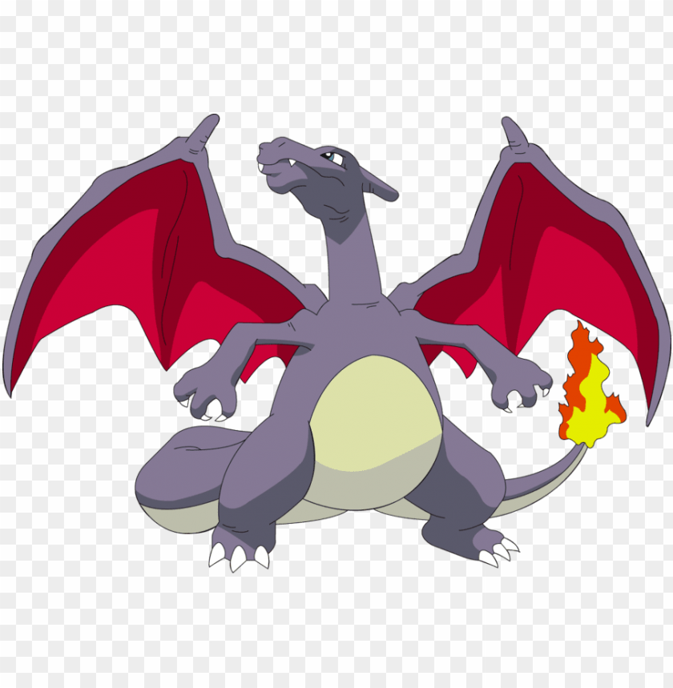

### Titulo h3
# Titulo h1
###### Titulo h6

**Texto de prueba bold**
*Texto de prueba bold*
> Texo cita
continuacion de cita

Lista ordenada
1. punto uno
2. punto dos
3. punto tres

Lista desordenada
- punto uno
- punto dos
- punto tres

###### *Linea de separación*
---
`texto de codigo`
`const num1 = num0 + num3;`

Enlace: [google](https://www.google.com)

Imagen: ``


Tabla:
| Columa 1 | Columna 2 |
| ----------- | ----------- |
| Contenido 1 | Texto 1 |
| Contenido 2 | Texto  2|


Codigo:
```json
{
  "firstName": "John",
  "lastName": "Smith",
  "age": 25
}
```

```js
{
  firstName: 'John',
  lastName: "Smith",
  age: 25
}
```
Texto con nota de pie. [^1]

[^1]: Nota de pie para el texto.

### My Great Heading {#custom-id}

Definición de termino
: El texto que define al termino

Texto tachado:
~~Este texto se tacho por alguna razon.~~

Lista de tareas:

- [x] Escribir el codigo
- [ ] Comentar el codigo
- [ ] Documentar

Emoji:
Carita sonriente! :smile:

Este texto tiene una palabra destacada ==palabra muy importante descatada==.

Subíndice:

H~2~O

Superíndice:

x^2^

HTML:

Texto con html incluido para un <span style="color:purple; font-weight:800">estilo</span>

